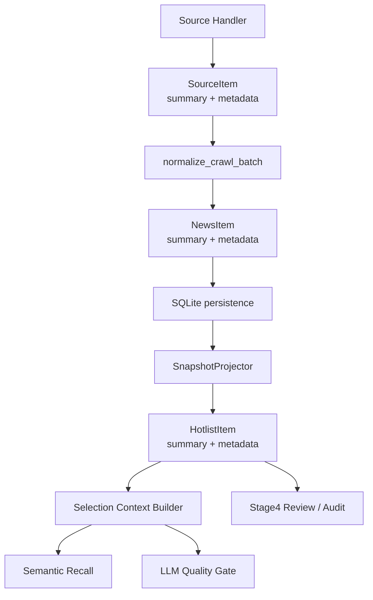

# Feature Design

## Overview

本设计把“GitHub Trending 结构增强”收口为一套通用的源上下文增强机制：

- crawler 负责尽量产出结构化上下文
- storage/snapshot 负责完整透传 `summary + metadata`
- selection 通过统一 context builder 消费上下文
- review/outbox 展示增强后的输入，便于调参与审阅

这次改造优先服务第 4 环节 Selection，但设计上不绑定 GitHub 单源，后续可复用到 Hacker News、Juejin、新闻热榜等 source。

## Non-Goals

- 不抓取正文全文
- 不解析 README / release notes 全文
- 不引入新的独立 GitHub 专用筛选管线
- 不修改 selection 阶段的整体漏斗顺序（仍然是 rule -> semantic -> LLM）

## Architecture



## Component Design

### 1. Shared Source Context Contract

涉及模块：
- `newspulse/crawler/sources/base.py`
- `newspulse/storage/base.py`
- `newspulse/workflow/shared/contracts.py`

改造内容：
- `SourceItem` 增加：
  - `summary: str = ""`
  - `metadata: dict[str, Any] = field(default_factory=dict)`
- `NewsItem` 增加：
  - `summary: str = ""`
  - `metadata: dict[str, Any] = field(default_factory=dict)`
- `HotlistItem` 增加：
  - `summary: str = ""`
  - `metadata: dict[str, Any] = field(default_factory=dict)`

设计原则：
- 主链路只暴露通用字段，不暴露 GitHub 专用类型
- 对没有增强字段的历史数据保持兼容

### 2. Storage Persistence

涉及模块：
- `newspulse/storage/schema.sql`
- `newspulse/storage/repos/news.py`
- `newspulse/storage/base.py`

推荐持久化方案：
- `news_items` 新增：
  - `summary TEXT DEFAULT ''`
  - `source_metadata_json TEXT DEFAULT '{}'`

原因：
- `summary` 是高频消费字段，单列直存最简单
- `metadata` 用 JSON 字符串承载 source 专有结构，避免 schema 被单源绑死

迁移策略：
- 初始化时检测列是否存在
- 不存在则补列
- 读取时对空值回退为默认值

### 3. Snapshot Projection

涉及模块：
- `newspulse/workflow/snapshot/projector.py`

改造内容：
- `normalize_crawl_batch()` 把 `SourceItem.summary/metadata` 写入 `NewsItem`
- `SnapshotProjector._to_hotlist_item()` 继续把 `NewsItem.summary/metadata` 投影到 `HotlistItem`

要求：
- 不改变现有 `news_item_id` 稳定性
- 不改变 current/daily/incremental 的模式行为

### 4. GitHub Trending Structured Enrichment

涉及模块：
- `newspulse/crawler/sources/tech.py`

设计为两段式：

#### 4.1 HTML 榜单抓取

保留 Trending 排名，同时从 HTML 提取：
- `full_name`
- `description`
- `language`
- `stars_total`
- `forks_total`
- `stars_today`

输出规范：
- `title` 统一为 `owner/repo`
- `summary` 填充 description
- `metadata["source_kind"] = "github_repository"`
- `metadata["github"] = {...}`

#### 4.2 API 富化

有 `GITHUB_TOKEN` 时，对前 N 个 repo 追加 API enrich：
- `topics`
- `created_at`
- `pushed_at`
- `archived`
- `fork`
- 缺失时补全 `description` / `language` / `stars_total`

降级策略：
- API 异常不影响 HTML 榜单结果
- 若 HTML 失败，则继续保留现有 search API fallback
- fallback 结果也尽量填入 `summary + metadata`

### 5. Source Metadata Shape

统一元信息结构：

```python
metadata = {
    "source_context_version": 1,
    "source_kind": "github_repository",
    "github": {
        "owner": "openai",
        "repo": "openai-agents-python",
        "full_name": "openai/openai-agents-python",
        "description": "Official OpenAI Agents SDK for Python",
        "language": "Python",
        "stars_total": 12345,
        "forks_total": 1200,
        "stars_today": 842,
        "topics": ["agent", "sdk", "openai"],
        "created_at": "...",
        "pushed_at": "...",
        "archived": False,
        "fork": False,
        "source_variant": "trending_html",
        "enriched_by": "html+api",
    },
}
```

复用规则：
- 通用层：`source_context_version`, `source_kind`
- source 专有层：`github`, `hackernews`, `juejin` 等命名空间

### 6. Selection Context Builder

新增模块：
- `newspulse/workflow/selection/context_builder.py`

建议数据结构：

```python
@dataclass(frozen=True)
class SelectionContext:
    headline: str
    summary: str
    source_line: str
    attributes: tuple[str, ...]
    embedding_text: str
    llm_text: str
```

职责：
- 从 `HotlistItem` 生成统一可消费上下文
- semantic 与 LLM 共享这层输出
- review/outbox 可复用同样的上下文摘要逻辑

GitHub 规则：
- `embedding_text` 包含：title、summary、language、topics、source
- `llm_text` 包含：title、summary、关键属性（如 stars_today / language / topics）
- 控制 token，避免把 metadata 原样全量灌进 prompt

### 7. Semantic Layer Integration

涉及模块：
- `newspulse/workflow/selection/semantic.py`

改造内容：
- 用 `build_selection_context(item).embedding_text` 替换 `_format_item_text()` 中的标题拼接逻辑

收益：
- GitHub Trending 不再只靠 repo slug 做语义召回
- 后续其他 source 只需增强 context builder，无需继续修改 semantic 主干

### 8. LLM Batch Input Integration

涉及模块：
- `newspulse/workflow/selection/models.py`
- `newspulse/workflow/selection/ai_classifier.py`

改造内容：
- `AIBatchNewsItem` 增加可渲染上下文字段，如：
  - `summary`
  - `context_lines`
- `_format_news_list()` 改为输出统一 context builder 产出的精简上下文

示例：

```text
12. [GitHub Trending] openai/openai-agents-python
summary: Official OpenAI Agents SDK for Python
language: Python
stars_today: 842
topics: agent, sdk, openai
```

### 9. Review / Audit Integration

涉及模块：
- `newspulse/workflow/selection/review.py`
- `newspulse/workflow/selection/audit.py`

改造内容：
- 在 `stage4_selection_ai.json` / `llm.json` 中展示 `summary` 和关键 metadata 摘要
- 在 Markdown 审阅文档中展示 GitHub 结构化上下文预览

目标：
- 让人工审阅能判断“保留的是明确产品/项目”，而不是只能看到 repo 名

## Data Flow

### GitHub Trending Example

1. `fetch_github_trending()` 输出 `SourceItem(title, summary, metadata)`
2. `normalize_crawl_batch()` 转成 `NewsItem(summary, metadata)`
3. storage 将其落盘到 `summary/source_metadata_json`
4. snapshot 输出 `HotlistItem(summary, metadata)`
5. `SelectionContextBuilder` 生成 `embedding_text/llm_text`
6. semantic/LLM 基于更厚的上下文做筛选
7. outbox 导出增强后的上下文，供人工审阅

## Error Handling

- HTML 解析失败：回退到 search API fallback
- API enrich 失败：保留 HTML 结果，不中断抓取
- metadata JSON 解析失败：记录 warning，回退为空 metadata
- 历史记录缺少 summary/metadata：回退到 title-only
- context builder 遇到未知 source_kind：走默认通用模板

## Testing Strategy

### Unit Tests

- `tests/test_builtin_sources.py`
  - GitHub Trending HTML 字段解析
  - API enrich 成功/失败降级
- storage roundtrip 测试
  - `SourceItem -> NewsItem -> HotlistItem` 字段不丢
- `tests/test_workflow_selection_semantic.py`
  - semantic 使用增强上下文
- `tests/test_workflow_selection_ai.py`
  - LLM batch prompt 使用增强上下文
- `tests/test_workflow_selection_review.py`
  - outbox 能展示 summary / metadata 摘要

### Integration Validation

- 跑 Selection 相关测试
- 跑全量测试
- 跑真实 stage4 outbox 对比 GitHub Trending 输入质量

## Rollout Plan

### Phase A
- 打通 `summary + metadata` 契约
- storage/schema 增强
- snapshot 透传

### Phase B
- GitHub Trending HTML 结构化增强
- API enrich 接入

### Phase C
- Selection context builder
- semantic / LLM 输入改造
- review/outbox 展示增强信息

### Phase D
- 回归测试
- 真实 stage4 审阅
- 根据结果微调上下文展示与筛选阈值
